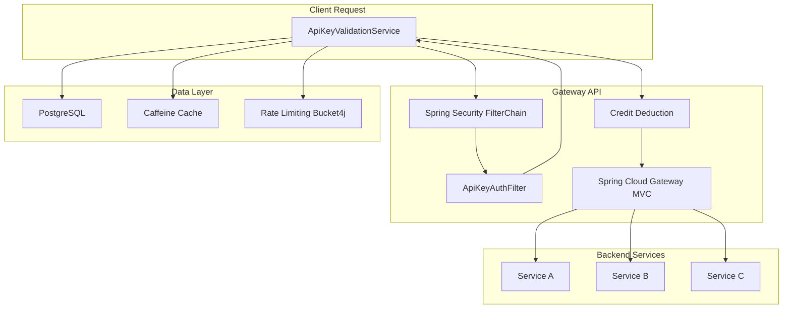

# API Credit Gateway - Implementation Plan

## Architecture Overview

The API Credit Gateway is a centralized gateway based on Spring Boot that acts as a middleware for API traffic validation and routing. It intercepts incoming traffic, validates API key credits, and delegates routing to Spring Cloud Gateway MVC.

### System Architecture



## Implementation Strategy

### Phase 1: Foundation Setup
1. **Update Dependencies** - Add required Spring Cloud, database, and caching dependencies
2. **Database Configuration** - Set up PostgreSQL connection and schema
3. **Model Classes** - Create JPA entities for API keys, users, and credits

### Phase 2: Core Services
1. **Repository Layer** - Implement Spring Data JDBC repositories
2. **Validation Service** - Create ApiKeyValidationService with caching and rate limiting
3. **Security Configuration** - Set up Spring Security filter chain

### Phase 3: Gateway Implementation
1. **Authentication Filter** - Implement ApiKeyAuthFilter
2. **Gateway Configuration** - Set up Spring Cloud Gateway MVC routing
3. **Cache Configuration** - Configure Caffeine cache

### Phase 4: Exception Handling & Monitoring
1. **Global Exception Handler** - Centralized error handling
2. **Health Checks** - Add monitoring endpoints
3. **Integration Tests** - End-to-end testing

## Detailed Implementation Plan

### 1. Dependencies (pom.xml)
Add required dependencies:
- Spring Cloud Gateway MVC
- Spring Data JDBC
- PostgreSQL driver
- Caffeine cache
- Bucket4j for rate limiting
- Lombok

### 2. Database Schema
```sql
CREATE TABLE api_keys (
    id BIGSERIAL PRIMARY KEY,
    key_hash VARCHAR(255) NOT NULL UNIQUE,
    owner_id VARCHAR(50) NOT NULL,
    credits INT NOT NULL DEFAULT 0 CHECK (credits >= 0),
    is_active BOOLEAN DEFAULT TRUE,
    rate_limit INT DEFAULT 10,
    created_at TIMESTAMP DEFAULT CURRENT_TIMESTAMP,
    updated_at TIMESTAMP DEFAULT CURRENT_TIMESTAMP
);

CREATE TABLE users (
    id BIGSERIAL PRIMARY KEY,
    username VARCHAR(50) NOT NULL UNIQUE,
    email VARCHAR(100) NOT NULL UNIQUE,
    created_at TIMESTAMP DEFAULT CURRENT_TIMESTAMP
);

CREATE TABLE user_credits (
    id BIGSERIAL PRIMARY KEY,
    user_id BIGINT NOT NULL REFERENCES users(id),
    service_id VARCHAR(50) NOT NULL,
    credits_available INT NOT NULL DEFAULT 0,
    created_at TIMESTAMP DEFAULT CURRENT_TIMESTAMP,
    updated_at TIMESTAMP DEFAULT CURRENT_TIMESTAMP,
    UNIQUE(user_id, service_id)
);
```

### 3. Package Structure
```
src/main/java/com/rnblock/gateway/
├── config/
│   ├── SecurityConfig.java
│   ├── GatewayConfig.java
│   └── CacheConfig.java
├── security/
│   ├── ApiKeyAuthFilter.java
│   └── ApiKeyAuthentication.java
├── service/
│   └── ApiKeyValidationService.java
├── repository/
│   ├── ApiKeyRepository.java
│   ├── UserRepository.java
│   └── UserCreditRepository.java
├── model/
│   ├── ApiKey.java
│   ├── User.java
│   └── UserCredit.java
├── exception/
│   ├── GlobalExceptionHandler.java
│   └── ApiExceptions.java
└── GatewayApplication.java
```

### 4. Key Components

#### Security Flow
1. Request arrives with `X-API-Key` or `Authorization: Bearer <key>`
2. `ApiKeyAuthFilter` extracts and validates the API key
3. `ApiKeyValidationService` checks cache first, then database
4. Rate limiting is enforced using Bucket4j
5. Credits are deducted atomically before routing
6. If validation fails, appropriate HTTP error is returned
7. If validation succeeds, request is routed via Spring Cloud Gateway MVC

#### Credit Management
- Atomic credit deduction using SQL UPDATE with WHERE clause
- Cache invalidation after credit changes
- Rate limiting per API key
- Support for different credit costs per service

#### Routing Configuration
```yaml
spring:
  cloud:
    gateway:
      mvc:
        routes:
          - id: service-a
            uri: http://service-a:8080
            predicates:
              - Path=/api/service-a/**
          - id: service-b
            uri: http://service-b:8080
            predicates:
              - Path=/api/service-b/**
```

### 5. Error Handling Strategy
- 401 Unauthorized: Missing or invalid API key
- 402 Payment Required: Insufficient credits
- 403 Forbidden: Rate limit exceeded or inactive API key
- 404 Not Found: Service not found
- 429 Too Many Requests: Rate limit exceeded
- 500 Internal Server Error: Database or service errors

### 6. Performance Considerations
- Caffeine cache for frequent API key lookups
- Connection pooling for PostgreSQL
- Asynchronous processing for non-blocking operations
- Circuit breaker pattern for backend service failures

### 7. Testing Strategy
- Unit tests for all service components
- Integration tests for the complete flow
- Performance testing for high throughput
- Security testing for API key validation

## Success Criteria

1. **Functional Requirements**
   - API key validation works correctly
   - Credit deduction is atomic and reliable
   - Rate limiting is enforced per API key
   - Routing works as configured
   - Error responses are appropriate

2. **Non-Functional Requirements**
   - High performance with low latency
   - Scalable architecture
   - Secure implementation
   - Monitoring and observability
   - Easy configuration and maintenance

## Timeline Estimate

- Phase 1: Foundation Setup - 2-3 days
- Phase 2: Core Services - 3-4 days
- Phase 3: Gateway Implementation - 2-3 days
- Phase 4: Exception Handling & Monitoring - 2 days
- Testing & Documentation - 2 days

**Total Estimated Time: 11-15 days**